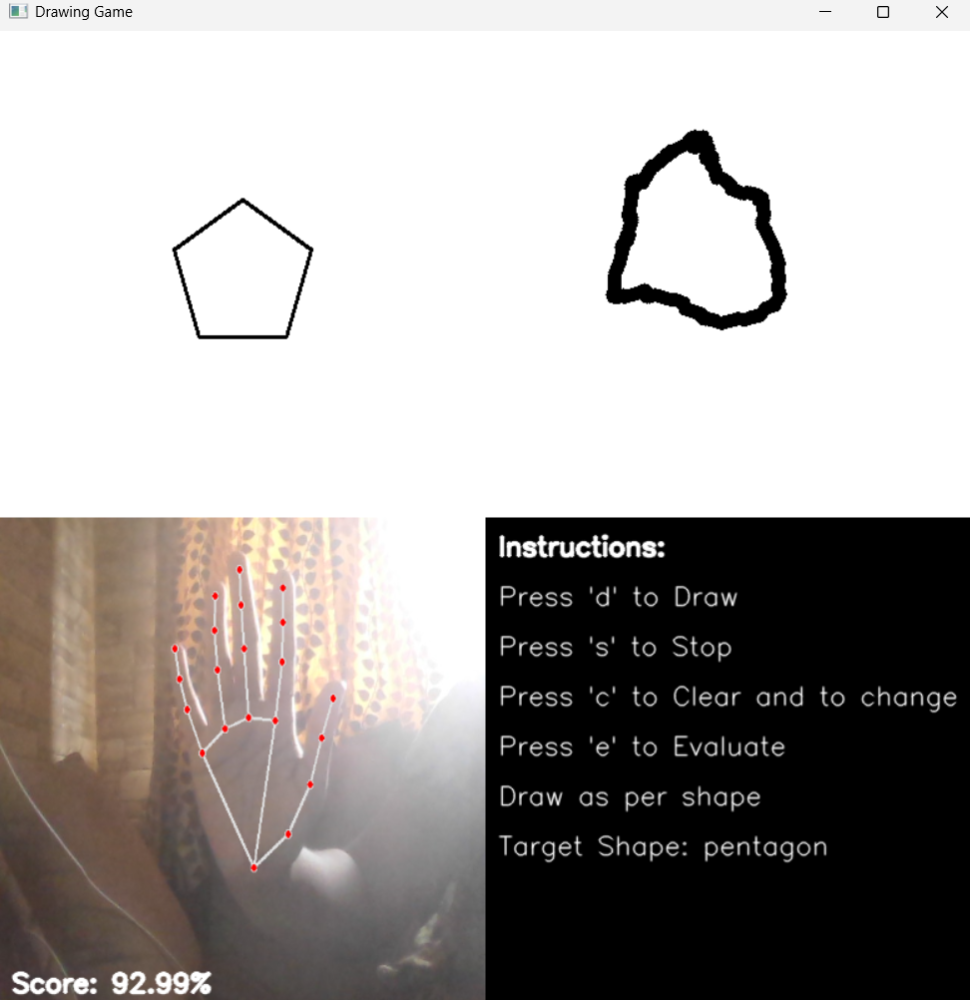

# Air Canvas 🎨✋

A real-time gesture-controlled **air canvas** where users draw shapes in the air using hand gestures.  
The system evaluates your drawing accuracy and gives a score instantly. Built using **OpenCV**, **MediaPipe**, and **Python**.

---

## 📷 Screenshots

> Upload your images in a `/screenshots` folder and reference them here like this:
## 📷 Project Screenshot


---

## 🚀 Features

- Draw shapes in the air using your index finger.
- Real-time hand tracking with **MediaPipe**.
- Random target shapes:
   - Triangle
   - Rectangle
   - Circle
   - Pentagon
   - Hexagon
- Score evaluation based on how closely your shape matches the target.
- Simple keyboard controls.

---

## 🎮 How to Use

1. **Run the Python script.**
2. Use your **index finger** to draw in the air.
3. Controls:
   - Press **`d`** to start drawing.
   - Press **`s`** to stop drawing.
   - Press **`e`** to evaluate your drawing and view your score.
   - Press **`c`** to clear the canvas and get a new shape.
   - Press **`q`** to quit.

---

## 📁 Files Included

- `air_canvas.py` : Main code file (your Python script).
- `screenshots/` : Example images (optional).
- `README.md` : This file.

---

## 🛠️ Technologies Used

- Python
- OpenCV
- MediaPipe
- NumPy

---

## 📦 Setup Instructions

1. Install dependencies:
```bash
pip install opencv-python mediapipe numpy
